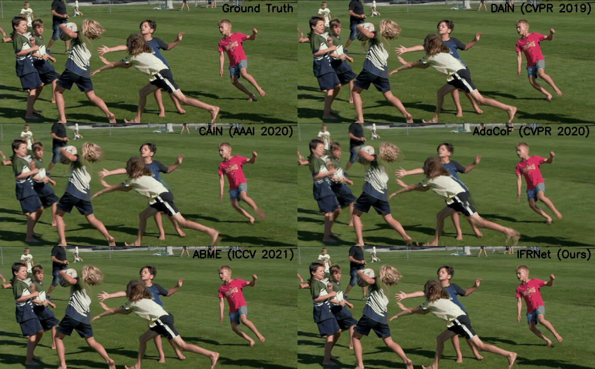

# IFRNet: Intermediate Feature Refine Network for Efficient Frame Interpolation
The official PyTorch implementation of [IFRNet](https://arxiv.org/abs/2205.14620) (CVPR 2022).

Authors: [Lingtong Kong](https://scholar.google.com.hk/citations?user=KKzKc_8AAAAJ&hl=zh-CN), [Boyuan Jiang](https://byjiang.com/), Donghao Luo, Wenqing Chu, Xiaoming Huang, [Ying Tai](https://tyshiwo.github.io/), Chengjie Wang, [Jie Yang](http://www.pami.sjtu.edu.cn/jieyang)

## Highlights
Existing flow-based frame interpolation methods almost all first estimate or model intermediate optical flow, and then use flow warped context features to synthesize target frame. However, they ignore the mutual promotion of intermediate optical flow and intermediate context feature. Also, their cascaded architecture can substantially increase the inference delay and model parameters, blocking them from lots of mobile and real-time applications. For the first time, we merge above separated flow estimation and context feature refinement into a single encoder-decoder based IFRNet for compactness and fast inference, where these two crucial elements can benefit from each other. Moreover, task-oriented flow distillation loss and feature space geometry consistency loss are newly proposed to promote intermediate motion estimation and intermediate feature reconstruction of IFRNet, respectively. Benchmark results demonstrate that our IFRNet not only achieves state-of-the-art VFI accuracy, but also enjoys fast inference speed and lightweight model size.

## Preparation
1. PyTorch >= 1.3.0 (We have verified that this repository supports Python 3.6/3.7, PyTorch 1.3.0/1.9.1).
2. Download training and test datasets: [Vimeo90K](http://toflow.csail.mit.edu/), [UCF101](https://liuziwei7.github.io/projects/VoxelFlow), [SNU-FILM](https://myungsub.github.io/CAIN/), [Middlebury](https://vision.middlebury.edu/flow/data/), [GoPro](https://seungjunnah.github.io/Datasets/gopro.html) and [Adobe240](http://www.cs.ubc.ca/labs/imager/tr/2017/DeepVideoDeblurring/).
3. Set the right dataset path on your machine.

## Download Pre-trained Models and Play with Demos
Figures from left to right are overlaid input frames, 2x and 8x video interpolation results respectively.

  
  
   

1. Download our pre-trained models in this [link](https://www.dropbox.com/sh/hrewbpedd2cgdp3/AADbEivu0-CKDQcHtKdMNJPJa?dl=0), and then put file <code> checkpoints</code> into the root dir.

2. Run the following scripts to generate 2x and 8x frame interpolation demos
<pre><code>$ python demo_2x.py</code>
<code>$ python demo_8x.py</code></pre>

## Training on Vimeo90K Triplet Dataset for 2x Frame Interpolation
1. First, run this script to generate optical flow pseudo label
<pre><code>$ python generate_flow.py</code></pre>

2. Then, start training by executing one of the following commands with selected model
<pre><code>$ python -m torch.distributed.launch --nproc_per_node=4 train_vimeo90k.py --world_size 4 --model_name 'IFRNet' --epochs 300 --batch_size 6 --lr_start 1e-4 --lr_end 1e-5</code>
<code>$ python -m torch.distributed.launch --nproc_per_node=4 train_vimeo90k.py --world_size 4 --model_name 'IFRNet_L' --epochs 300 --batch_size 6 --lr_start 1e-4 --lr_end 1e-5</code>
<code>$ python -m torch.distributed.launch --nproc_per_node=4 train_vimeo90k.py --world_size 4 --model_name 'IFRNet_S' --epochs 300 --batch_size 6 --lr_start 1e-4 --lr_end 1e-5</code></pre>

## Benchmarks for 2x Frame Interpolation
To test running time and model parameters, you can run
<pre><code>$ python benchmarks/speed_parameters.py</code></pre>

To test frame interpolation accuracy on Vimeo90K, UCF101 and SNU-FILM datasets, you can run
<pre><code>$ python benchmarks/Vimeo90K.py</code>
<code>$ python benchmarks/UCF101.py</code>
<code>$ python benchmarks/SNU_FILM.py</code></pre>

## Quantitative Comparison for 2x Frame Interpolation
Proposed IFRNet achieves state-of-the-art frame interpolation accuracy with less inference time and computation complexity. We expect proposed single encoder-decoder joint refinement based IFRNet to be a useful component for many frame rate up-conversion, video compression and intermediate view synthesis systems. Time and FLOPs are measured on 1280 x 720 resolution.

## Qualitative Comparison for 2x Frame Interpolation
Video comparison for 2x interpolation of methods using 2 input frames on SNU-FILM dataset.

## Middlebury Benchmark
Results on the [Middlebury](https://vision.middlebury.edu/flow/eval/results/results-i1.php) online benchmark.

Results on the Middlebury Other dataset.

## Training on GoPro Dataset for 8x Frame Interpolation
1. Start training by executing one of the following commands with selected model
<pre><code>$ python -m torch.distributed.launch --nproc_per_node=4 train_vimeo90k.py --world_size 4 --model_name 'IFRNet' --epochs 300 --batch_size 6 --lr_start 1e-4 --lr_end 1e-5</code>
<code>$ python -m torch.distributed.launch --nproc_per_node=4 train_vimeo90k.py --world_size 4 --model_name 'IFRNet_L' --epochs 300 --batch_size 6 --lr_start 1e-4 --lr_end 1e-5</code>
<code>$ python -m torch.distributed.launch --nproc_per_node=4 train_vimeo90k.py --world_size 4 --model_name 'IFRNet_S' --epochs 300 --batch_size 6 --lr_start 1e-4 --lr_end 1e-5</code></pre>

Since inter-frame motion in 8x interpolation setting is relatively small, task-oriented flow distillation loss is omitted here. Due to the GoPro training set is a relatively small dataset, we suggest to use your specific datasets to train slow-motion generation for better results.

## Quantitative Comparison for 8x Frame Interpolation

## Qualitative Results on GoPro and Adobe240 Datasets for 8x Frame Interpolation
Each video has 9 frames, where the first and the last frames are input, and the middle 7 frames are predicted by IFRNet.

  
  
   

## Citation
If you think this project is helpful, please star it. When using any parts of the Software or the Paper in your work, please cite the following paper:
<pre><code>@InProceedings{Kong_2022_CVPR, 
  author = {Kong, Lingtong and Jiang, Boyuan and Luo, Donghao and Chu, Wenqing and Huang, Xiaoming and Tai, Ying and Wang, Chengjie and Yang, Jie}, 
  title = {IFRNet: Intermediate Feature Refine Network for Efficient Frame Interpolation}, 
  booktitle = {Proceedings of the IEEE/CVF Conference on Computer Vision and Pattern Recognition (CVPR)}, 
  year = {2022},
}</code></pre>
