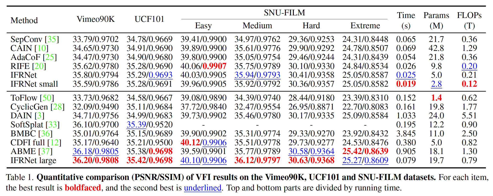
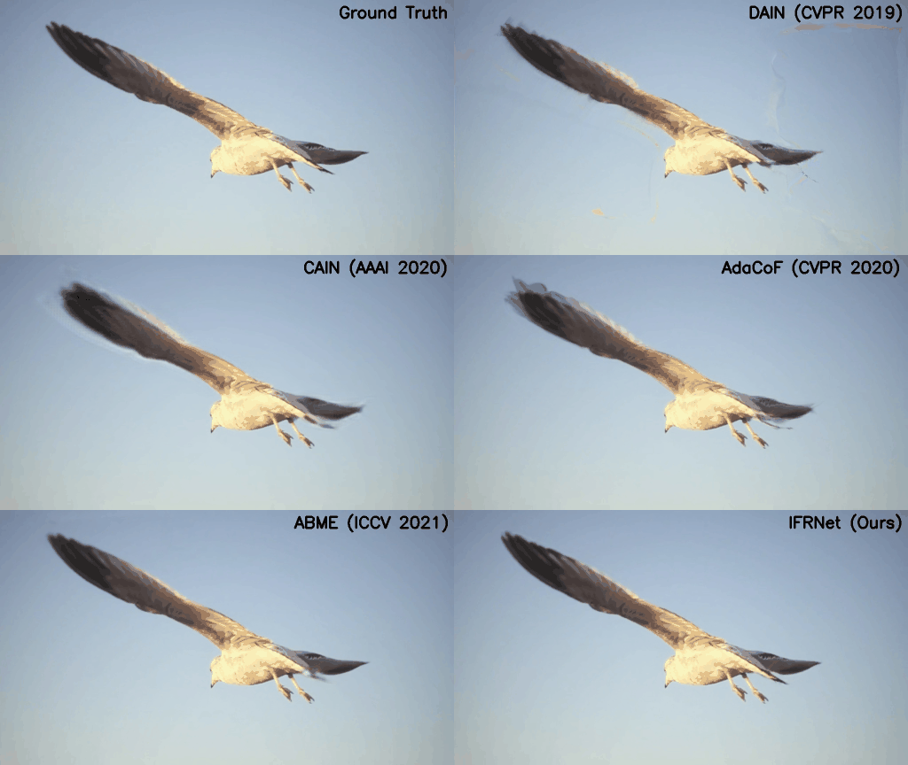

# IFRNet: Intermediate Feature Refine Network for Efficient Frame Interpolation
The official PyTorch implementation of [IFRNet](https://arxiv.org/abs/2205.14620) (CVPR 2022).

Authors: [Lingtong Kong](https://scholar.google.com.hk/citations?user=KKzKc_8AAAAJ&hl=zh-CN), [Boyuan Jiang](https://byjiang.com/), Donghao Luo, Wenqing Chu, Xiaoming Huang, [Ying Tai](https://tyshiwo.github.io/), Chengjie Wang, [Jie Yang](http://www.pami.sjtu.edu.cn/jieyang)

## Highlights
Existing flow based frame interpolation methods almost all first estimate or model intermediate optical flow, and then use flow warped context features to synthesize target frame. However, they ignore the mutual promotion of intermediate optical flow and intermediate context feature. Also, their cascaded architecture can substantially increase the inference delay and model parameters, blocking them from lots of mobile and real-time applications. For the first time, we merge above separated flow estimation and context feature refinement into a single encoder-decoder based IFRNet for compactness and fast inference, where these two crucial elements can benefit from each other. Moreover, task-oriented flow distillation loss and feature space geometry consistency loss are newly proposed to promote intermediate motion estimation and intermediate feature reconstruction of IFRNet, respectively. Benchmark results demonstrate that our IFRNet not only achieves state-of-the-art VFI accuracy, but also enjoys fast inference speed and lightweight model size.

## Download Pre-trained Models and Run the Demos

  
  
   

Figures from left to right are overlaid input frames, x2 and 8x frame interpolation results respectively.

1. Download our pre-trained models in this [link](https://www.dropbox.com/sh/hrewbpedd2cgdp3/AADbEivu0-CKDQcHtKdMNJPJa?dl=0), and put file <code> checkpoints</code> into the root dir.
2. Run the following scripts to generate x2 and 8x frame interpolation demos.
<pre><code>$ python demo_2x.py</code></pre>
<pre><code>$ python demo_8x.py</code></pre>

## Training on Vimeo90K Triplet Dataset for 2x Frame Interpolation
1. First, run this script to generate optical flow pseudo label
<pre><code>$ python generate_flow.py</code></pre>

2. Then, start training by executing one of the following commands
<pre><code>$ python -m torch.distributed.launch --nproc_per_node=4 train_vimeo90k.py --world_size 4 --model_name 'IFRNet' --epochs 300 --batch_size 6 --lr_start 1e-4 --lr_end 1e-5</code></pre>
<pre><code>$ python -m torch.distributed.launch --nproc_per_node=4 train_vimeo90k.py --world_size 4 --model_name 'IFRNet_L' --epochs 300 --batch_size 6 --lr_start 1e-4 --lr_end 1e-5</code></pre>
<pre><code>$ python -m torch.distributed.launch --nproc_per_node=4 train_vimeo90k.py --world_size 4 --model_name 'IFRNet_S' --epochs 300 --batch_size 6 --lr_start 1e-4 --lr_end 1e-5</code></pre>

## Benchmarks for 2x Frame Interpolation
To test speed and parameters you can run
<pre><code>$ python benchmarks/speed_parameters.py</code></pre>
To test on Vimeo90K you can run
<pre><code>$ python benchmarks/Vimeo90K.py</code></pre>
To test on UCF101 you can run
<pre><code>$ python benchmarks/UCF101.py</code></pre>
To test on SNU-FILM you can run
<pre><code>$ python benchmarks/SNU_FILM.py</code></pre>

## Quantitative Comparison for 2x Frame Interpolation
Proposed IFRNet achieves state-of-the-art frame interpolation accuracy with less inference time and computation complexity. We expect proposed single encoder-decoder joint refinement based IFRNet to be a useful component for many frame rate up-conversion and intermediate view synthesis systems.

## Qualitative Comparison for 2x Frame Interpolation
Video comparison for 2x interpolation of methods using 2 input frames on SNU-FILM dataset.

## Middlebury Online Benchmark
Results on the [Middlebury](https://vision.middlebury.edu/flow/eval/results/results-i1.php) online benchmark.

## Multi-Frame Interpolation
Quantitative comparison for 8x interpolation of methods using 2 input frames.

Qualitative results of IFRNet for 8x interpolation on GoPro and Adobe240 test datasets. Each video has 9 frames where the first and the last frames are input, and the middle 7 frames are predicted by IFRNet.

  
  
   

